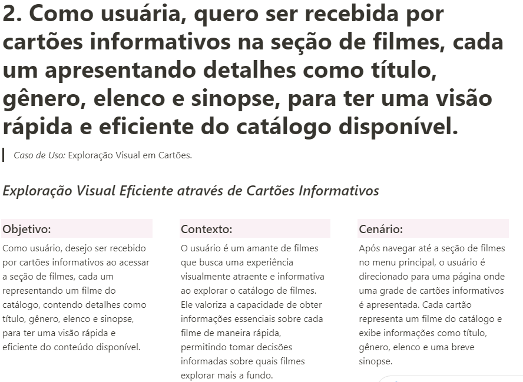
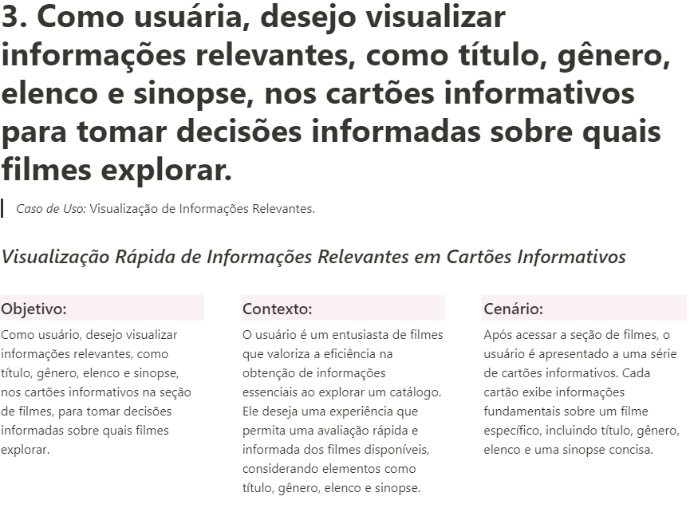
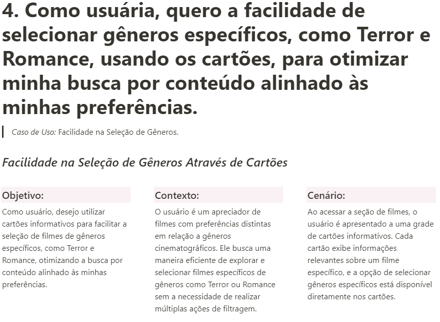

<h1>
    
    Projeto 02 - Dataverse
</h1>

## 📚Confira meu caderno de estudos:

# 1. Resumo do Projeto

### O sistema oferece uma experiência eficiente para entusiastas de filmes explorarem um catálogo, fornecendo informações cruciais, como título, gênero, elenco e sinopse. As usuárias podem filtrar e ordenar os filmes com base em suas preferências pessoais, proporcionando uma navegação intuitiva e personalizada para descobrir novos títulos de entretenimento audiovisual.

# 2. História de usuário

